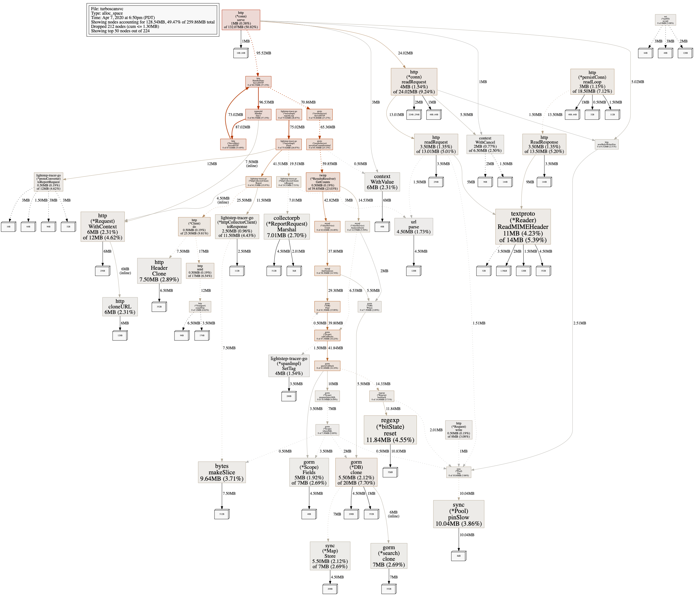

# Accessing the /debug/pprof endpoints in production

`turboscansvc` has [pprof](https://github.com/google/pprof) enabled and can be used to visualize runtime profiling, such as stack trace of all goroutines, a sampling of live memory allocations, a sampling of all past memory allocations, or CPU profiling. It's highly customizable, but we're using the standard profiles defined in the [runtime/pprof](https://golang.org/pkg/runtime/pprof/) package.

For GitHub Cloud (not Enterprise Server), you can use the `.ts pprof` chatops command to retrieve a pprof profile for a given profile name. For example the `.ts pprof --profile allocs` will give us the results that show the amount of memory allocated, including memory that's been freed. To get this information out of the file, we are going to use the `go tool pprof` command. Below the steps you need to do:

1. Run the following chatops command:

   ```text
   .ts pprof --profile allocs
   ```

   This will return a `base64` encoded file.

2. Download the file to your localhost and decode the base64 encoded file:

   ```shell
   cat downloaded-file | base64 --decode > allocs.pb.gz
   ```

3. Finally run the `go tool pprof`  command for the downloaded file:

   ```shell
   go tool pprof -trim_path=/app bin/turboscan service start turboscansvc allocs.pb.gz
   ```

Couple of things here to note:

* We're going to get to the service running in the `iad` datacenter because that's how our chatops service is configured (see: https://github.com/github/hubot-classic/blob/ec19faf91878413a82e118b4e492b12e9c06212d/config/chatops-rpc/production.yaml#L1725). Depending on how much traffic this particular service receive, you might want to make sure it's sufficiently getting traffic so the pprof dump is useful.
* We're passing the `bin/turboscansvc` binary so the profile data can be correctly associated (such as object names, file names, etc...) hence make sure to compile the binary via: `go build -o bin/turboscansvc ./cmd/turboscansvc`
* We use the `-trim_path=/app` flag because the production binary is compiled in a Docker container, hence it contains references to its internal filesystem layout.
* This will open an interactive shell, to quit the shell, write `quit`, `exit` or hit `CTRL-D`
* `pprof` records only fraction of the stacktraces associated with an event (for example the above memory allocation) so we shouldn't expect the same values for invocation. Every `go tool pprof` call will give us a different result. This approach makes pprof safe to use in production.

Now type `top 10`, this will show us the top entries to `10` samples:

```text
(pprof) top 10
Showing nodes accounting for 82.03MB, 31.57% of 259.86MB total
Dropped 212 nodes (cum <= 1.30MB)
Showing top 10 nodes out of 224
      flat  flat%   sum%        cum   cum%
   11.84MB  4.55%  4.55%    11.84MB  4.55%  regexp.(*bitState).reset
      11MB  4.23%  8.79%       14MB  5.39%  net/textproto.(*Reader).ReadMIMEHeader
   10.04MB  3.86% 12.65%    10.04MB  3.86%  sync.(*Pool).pinSlow
    9.64MB  3.71% 16.36%     9.64MB  3.71%  bytes.makeSlice
    7.50MB  2.89% 19.25%     7.50MB  2.89%  net/http.Header.Clone
    7.01MB  2.70% 21.95%     7.01MB  2.70%  github.com/lightstep/lightstep-tracer-common/golang/gogo/collectorpb.(*ReportRequest).Marshal
       7MB  2.69% 24.64%        7MB  2.69%  github.com/jinzhu/gorm.(*search).clone
       6MB  2.31% 26.95%       12MB  4.62%  net/http.(*Request).WithContext
       6MB  2.31% 29.26%        6MB  2.31%  net/http.cloneURL (inline)
       6MB  2.31% 31.57%        6MB  2.31%  context.WithValue
```

In this example, `pprof` is showing that the first row `regexp.(*bitState).reset` has consumed so far 11.84MB. Of course as said, this is just a representation of the current sample.

Now type `png` into the interactive shell (you might have to install `graphviz`).

```text
(pprof) png
Generating report in profile001.png
```

This will generate a graph that shows how much memory each node has allocated so far:



## Accessing local turboscansvc endpoints

If you wish, you can also access a locally run `turboscansvc` service:

```shell
go tool pprof bin/turboscan service start turboscansvc "http://localhost:8888/debug/pprof/allocs"
```

Note that this might be not particular handy as the service is not fully utilized, hence you might have to simulate a production load

## Documentation & blogs

`pprof` is a very advanced tool with many knobs and settings. Hence it's difficult to show all the features here. Below are some followup blog posts on how to use pprof and see how other companies have used `pprof` to track down memory leaks in their services:

* [https://blog.golang.org/profiling-go-programs]
* [https://jvns.ca/blog/2017/09/24/profiling-go-with-pprof/]
* [https://blog.detectify.com/2019/09/05/how-we-tracked-down-a-memory-leak-in-one-of-our-go-microservices/]
* [https://austburn.me/blog/go-profile.html]
* [https://github.com/golang/go/wiki/Performance]
